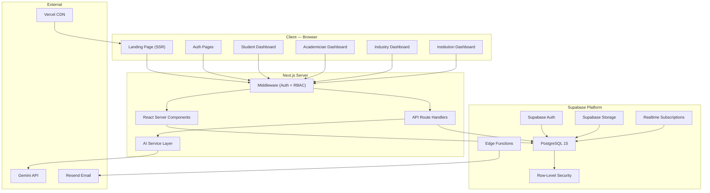
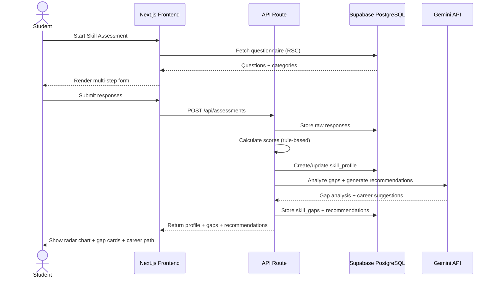
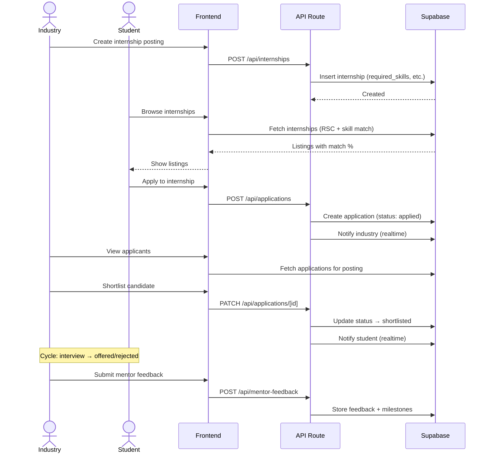

# SCI — Student Council of India
## Architecture & Implementation Plan

**Portal for Academia–Industry Collaboration: Skill Mapping, Internships & Placement**

> [!NOTE]
> **Companion Files**: This plan is supported by two persistent reference files:
> - [AGENTS.md](file:///home/supreme/Documents/Project/Web/SIH/.agents/AGENTS.md) — Canonical tech stack, conventions, and rules for all agents
> - [memory.md](file:///home/supreme/Documents/Project/Web/SIH/.agents/memory.md) — Living changelog with decisions, state, and traceability matrix

---

## Phase 3 Implementation Plan (Pending Approval)

# Phase 3: Internship & Job Portal + Application Tracking

This phase will build out the core marketplace of SCI, allowing Industry and Academician roles to post opportunities, and Students to discover, match, and apply for them.

## User Review Required

> [!IMPORTANT]
> **Action Required:** Please review the database schema and UI components planned below. Once you approve, I will proceed with creating the migrations and the frontend pages.

## Open Questions

1. **Job Types:** Are we only tracking standard Internships and Full-time Jobs, or do we need categories for Freelance, Research Assistant, or Part-time roles?
2. **Resume Upload:** For applications, should we require a PDF resume upload to Supabase Storage, or rely entirely on their SCI Skill Profile? (I recommend supporting both).

## Proposed Changes

---

### Database Migrations

#### [NEW] `supabase/migrations/00010_create_job_listings.sql`
- Will create the `job_listings` table to store Internships and Jobs.
- Columns: `id`, `employer_id` (Industry/Institution), `title`, `description`, `type` (internship/job), `location`, `is_remote`, `stipend_salary_range`, `status` (open/closed/draft), `deadline`, `required_skills` (JSONB mapping skill names to proficiency levels).
- Row-Level Security:
  - Industry users can CRUD their own listings.
  - All users can read open listings.

#### [NEW] `supabase/migrations/00011_create_job_applications.sql`
- Will create the `job_applications` table.
- Columns: `id`, `job_id`, `student_id`, `status` (applied, under_review, shortlisted, interview, offered, rejected), `cover_letter`, `resume_url`, `match_score` (calculated AI fit percentage).
- Row-Level Security:
  - Students can view/create their own applications.
  - Industry users can view applications for their listings.

#### [NEW] `supabase/migrations/00012_create_mentor_feedback.sql`
- Will create the `mentor_feedback` table for Industry Mentors to leave feedback on student interns.
- Columns: `id`, `application_id`, `mentor_id`, `feedback_text`, `performance_rating`, `milestone_reached`.

---

### Application API Routes

#### [NEW] `src/app/api/jobs/route.ts`
- `GET`: Fetch job listings with filters (type, remote, skills).
- `POST`: Industry creates a new job listing.

#### [NEW] `src/app/api/applications/route.ts`
- `POST`: Student applies to a job. Will use the AI skill-analyzer to generate a `match_score` based on their profile vs the job's `required_skills` JSON.

#### [NEW] `src/app/api/applications/[id]/status/route.ts`
- `PATCH`: Industry updates the status of an application (e.g. `applied` -> `shortlisted`).

---

### Student UI (Discover & Apply)

#### [NEW] `src/app/(dashboard)/student/jobs/page.tsx`
- The main job board. A faceted search interface to find opportunities.

#### [NEW] `src/components/jobs/job-card.tsx`
- Reusable UI component displaying job title, company, stipend, and a dynamic "Match Score" ring based on the student's profile.

#### [NEW] `src/app/(dashboard)/student/applications/page.tsx`
- Application tracking dashboard (Kanban or List view showing applied, shortlisted, etc.).

---

### Industry UI (Manage & Shortlist)

#### [NEW] `src/app/(dashboard)/industry/jobs/page.tsx`
- Industry dashboard showing active postings and quick stats (e.g. "12 New Applicants").

#### [NEW] `src/app/(dashboard)/industry/jobs/[id]/applicants/page.tsx`
- Applicant tracking system (ATS) view for a specific job. Sortable by AI `match_score`. Ability to update applicant status and leave mentor feedback.

## Verification Plan

### Automated Tests
- None configured currently, relying on strict TypeScript types.

### Manual Verification
- We will log in as an **Industry** user, post a new "Software Engineering Internship", and set the required skills.
- We will log in as a **Student** user, view the internship board, check the match score, and apply.
- We will log back in as the **Industry** user, review the student's application, and move them to "Shortlisted".

## Technology Stack

| Layer | Technology | Purpose |
|---|---|---|
| **Framework** | Next.js 15 (App Router) + TypeScript | SSR, RSC, API routes, middleware, SEO |
| **Database** | Supabase (PostgreSQL 15) | Auth, RLS, Realtime, Storage, Edge Functions |
| **Auth** | Supabase Auth | Email/Password, Google, LinkedIn, Magic Link |
| **Styling** | Tailwind CSS v4 | Utility-first, CSS-first config, dark mode |
| **Components** | shadcn/ui + Radix UI | Accessible, composable, premium components |
| **Forms** | React Hook Form + Zod | Type-safe validation |
| **State** | Zustand + TanStack React Query v5 | Client + server state |
| **Charts** | Recharts | Analytics dashboards |
| **AI** | Gemini API (`@google/genai`) | Skill analysis, recommendations, career guidance |
| **Storage** | Supabase Storage | Resumes, certificates, reports, avatars |
| **Email** | Resend | Transactional notifications |
| **Icons** | Lucide React | Consistent iconography |
| **Deployment** | Vercel | Edge network, preview deploys |

---

## System Architecture



### Data Flow — Skill Assessment to Recommendation



### Data Flow — Internship Application Lifecycle



---

## Database Schema (Complete ERD)

```mermaid
erDiagram
    profiles ||--o{ skill_assessments : "takes"
    profiles ||--o{ skill_profiles : "has"
    profiles ||--o{ applications : "submits"
    profiles ||--o{ digital_portfolios : "owns"
    profiles ||--o{ notifications : "receives"
    profiles ||--o{ mentor_feedback : "gives"
    profiles }o--|| institutions : "belongs to"
    profiles }o--|| industries : "works at"

    institutions ||--o{ departments : "contains"
    institutions ||--o{ profiles : "manages"

    industries ||--o{ internships : "posts"
    industries ||--o{ job_postings : "posts"
    industries ||--o{ learning_programs : "publishes"
    industries ||--o{ collaboration_programs : "creates"

    internships ||--o{ applications : "receives"
    job_postings ||--o{ applications : "receives"
    learning_programs ||--o{ program_enrollments : "has"

    skill_profiles ||--o{ skill_gaps : "identifies"
    skill_profiles ||--o{ recommendations : "generates"

    applications ||--o{ mentor_feedback : "has"
    collaboration_programs ||--o{ program_enrollments : "has"

    profiles {
        uuid id PK
        uuid auth_id FK "supabase auth.users"
        string email UK
        enum role "student | academician | industry | institution"
        string full_name
        string phone
        string avatar_url
        uuid institution_id FK "nullable"
        uuid industry_id FK "nullable"
        string department
        string designation
        text bio
        jsonb social_links "linkedin, github, etc."
        jsonb metadata "role-specific extra fields"
        boolean is_verified
        boolean is_active
        timestamp created_at
        timestamp updated_at
    }

    institutions {
        uuid id PK
        string name
        string code "AICTE code etc."
        enum type "university | college | polytechnic | institute"
        string location
        string state
        string city
        string pincode
        string website
        string logo_url
        string contact_email
        string contact_phone
        jsonb settings "platform config"
        boolean is_verified
        timestamp created_at
        timestamp updated_at
    }

    departments {
        uuid id PK
        uuid institution_id FK
        string name
        string code "e.g. CSE, ECE"
        string hod_name
        boolean is_active
    }

    industries {
        uuid id PK
        string company_name
        string industry_sector "IT, Manufacturing, etc."
        string company_size "startup | sme | large | mnc"
        string website
        string logo_url
        text description
        string headquarters
        string locations "comma-sep or JSONB"
        string contact_email
        string contact_person
        boolean is_verified
        timestamp created_at
        timestamp updated_at
    }

    skill_assessments {
        uuid id PK
        uuid user_id FK
        string assessment_type "technical | soft | aptitude | combined"
        jsonb questions_snapshot "frozen copy of questions"
        jsonb responses "user answers"
        jsonb category_scores "per-category breakdown"
        float overall_score
        integer time_taken_seconds
        integer attempt_number
        timestamp started_at
        timestamp completed_at
        timestamp created_at
    }

    skill_profiles {
        uuid id PK
        uuid user_id FK UK
        jsonb technical_skills "skill: level (0-100)"
        jsonb soft_skills "skill: level (0-100)"
        jsonb domain_skills "industry-specific"
        jsonb strengths "top skills"
        jsonb weaknesses "bottom skills"
        float employability_score "0-100"
        string career_readiness "beginner | intermediate | advanced | industry_ready"
        jsonb industry_alignment "sector: match%"
        timestamp last_assessed_at
        timestamp created_at
        timestamp updated_at
    }

    skill_gaps {
        uuid id PK
        uuid skill_profile_id FK
        string skill_name
        enum category "technical | soft | domain"
        float current_level
        float required_level
        float gap_score "required - current"
        string priority "critical | high | medium | low"
        jsonb recommended_resources "courses, certs, etc."
        timestamp identified_at
    }

    internships {
        uuid id PK
        uuid industry_id FK
        string title
        text description
        text responsibilities
        jsonb required_skills "skill: min_level"
        jsonb preferred_skills
        string duration "e.g. 3 months"
        string stipend "e.g. 10000/month or Unpaid"
        enum location_type "remote | onsite | hybrid"
        string location "city if onsite/hybrid"
        integer max_applicants
        date application_deadline
        date start_date
        date end_date
        enum target_audience "student | academician | both"
        enum status "draft | open | closed | filled | cancelled"
        jsonb eligibility "year, branch, CGPA, etc."
        integer views_count
        timestamp created_at
        timestamp updated_at
    }

    job_postings {
        uuid id PK
        uuid industry_id FK
        string title
        text description
        text responsibilities
        jsonb required_skills
        jsonb qualifications "degree, specialization"
        string experience_level "fresher | 0-1yr | 1-3yr"
        string salary_range
        string employment_type "full-time | part-time | contract"
        enum location_type "remote | onsite | hybrid"
        string location
        integer max_applicants
        date application_deadline
        enum status "draft | open | closed | filled | cancelled"
        jsonb eligibility
        integer views_count
        timestamp created_at
        timestamp updated_at
    }

    applications {
        uuid id PK
        uuid user_id FK
        uuid internship_id FK "nullable — one of these two"
        uuid job_id FK "nullable — must be set"
        enum status "applied | under_review | shortlisted | interview_scheduled | interviewed | offered | accepted | rejected | withdrawn"
        text cover_letter
        string resume_url
        jsonb additional_docs "cert URLs etc."
        jsonb recruiter_notes "internal notes"
        float skill_match_score "calculated match %"
        timestamp applied_at
        timestamp last_status_change
        timestamp created_at
        timestamp updated_at
    }

    learning_programs {
        uuid id PK
        uuid industry_id FK
        string title
        text description
        enum program_type "certification | workshop | mentorship | training | bootcamp | webinar | course"
        jsonb skills_covered
        string duration
        string cost "free | amount"
        boolean is_free
        string url "external link if applicable"
        string platform "Coursera, internal, etc."
        integer max_participants
        date start_date
        date end_date
        date registration_deadline
        enum status "upcoming | active | completed | cancelled"
        enum target_audience "student | academician | both"
        timestamp created_at
        timestamp updated_at
    }

    collaboration_programs {
        uuid id PK
        uuid industry_id FK
        string title
        text description
        enum program_type "mentorship | workshop | guest_lecture | hackathon | innovation_challenge | live_project | research_collab | fdp | consultancy | industrial_training"
        jsonb requirements "skills, eligibility"
        jsonb deliverables
        string duration
        date start_date
        date end_date
        date application_deadline
        integer max_participants
        enum target_audience "student | academician | both"
        enum status "upcoming | open | active | completed | cancelled"
        string location
        enum mode "online | offline | hybrid"
        timestamp created_at
        timestamp updated_at
    }

    program_enrollments {
        uuid id PK
        uuid user_id FK
        uuid learning_program_id FK "nullable"
        uuid collaboration_program_id FK "nullable"
        enum status "enrolled | in_progress | completed | dropped"
        float progress_percentage
        jsonb completion_data "cert URL, score, etc."
        timestamp enrolled_at
        timestamp completed_at
    }

    digital_portfolios {
        uuid id PK
        uuid user_id FK UK
        jsonb verified_skills "skill, source, date verified"
        jsonb certifications "name, issuer, date, URL, verified"
        jsonb projects "title, description, tech, URL, media"
        jsonb internship_records "company, role, duration, verified"
        jsonb achievements "title, description, date, type"
        jsonb education "degree, institution, year, CGPA"
        jsonb work_experience "if any"
        text personal_statement
        string portfolio_url "public slug"
        boolean is_public
        integer profile_completeness "0-100%"
        timestamp created_at
        timestamp updated_at
    }

    recommendations {
        uuid id PK
        uuid user_id FK
        uuid skill_profile_id FK
        enum recommendation_type "internship | job | course | certification | career_path"
        uuid target_id "FK to the recommended entity"
        string target_table "which table target_id references"
        float match_score "0-100"
        text reasoning "AI-generated explanation"
        jsonb matching_skills "skills that matched"
        jsonb missing_skills "skills to develop"
        boolean is_dismissed "user dismissed this"
        timestamp generated_at
        timestamp expires_at
    }

    notifications {
        uuid id PK
        uuid user_id FK
        string title
        text message
        enum notification_type "application_update | new_recommendation | deadline_reminder | new_opportunity | mentor_feedback | system | achievement"
        enum channel "in_app | email | both"
        boolean is_read
        string action_url "link to relevant page"
        jsonb metadata
        timestamp created_at
        timestamp read_at
    }

    mentor_feedback {
        uuid id PK
        uuid application_id FK
        uuid mentor_id FK "profiles.id of industry user"
        uuid mentee_id FK "profiles.id of student/academician"
        integer rating "1-5"
        text feedback_text
        jsonb skill_ratings "per-skill rating"
        jsonb milestones "milestone, status, date"
        enum feedback_type "progress | mid_term | final"
        timestamp created_at
    }

    documents {
        uuid id PK
        uuid user_id FK
        string file_name
        string file_url "Supabase Storage path"
        enum document_type "resume | certificate | internship_report | academic_record | project_report | other"
        string mime_type
        integer file_size_bytes
        boolean is_verified
        uuid verified_by FK "nullable"
        jsonb metadata
        timestamp uploaded_at
    }

    career_paths {
        uuid id PK
        string title "e.g. Full-Stack Developer"
        string industry_sector
        text description
        jsonb required_skills "with levels"
        jsonb recommended_certifications
        jsonb salary_insights "entry, mid, senior"
        jsonb growth_trajectory "roles over time"
        jsonb related_paths
        boolean is_active
        timestamp created_at
        timestamp updated_at
    }

    assessment_templates {
        uuid id PK
        string title
        text description
        enum assessment_type "technical | soft | aptitude | domain_specific"
        string industry_sector "nullable — for sector-specific"
        jsonb questions "array of question objects"
        integer time_limit_minutes
        boolean is_active
        uuid created_by FK
        timestamp created_at
        timestamp updated_at
    }
```

---

## Complete Project Structure

```
SIH/
├── .agents/
│   ├── AGENTS.md                        # Project reference for all agents ✅
│   └── memory.md                        # Living changelog ✅
│
├── .env.local                           # Environment variables (gitignored)
├── .env.example                         # Template for contributors
├── .gitignore
├── next.config.ts                       # Next.js config
├── package.json
├── tsconfig.json
├── components.json                      # shadcn/ui config
├── README.md                            # Project README
│
├── public/
│   ├── images/
│   │   ├── logo.svg                     # SCI logo
│   │   ├── hero-illustration.svg        # Landing page hero
│   │   └── og-image.png                 # Social sharing image
│   └── fonts/                           # Self-hosted fonts (Inter)
│
├── src/
│   ├── app/
│   │   ├── layout.tsx                   # Root layout (providers, fonts, meta)
│   │   ├── page.tsx                     # Landing page (/)
│   │   ├── globals.css                  # Tailwind directives + theme tokens
│   │   ├── not-found.tsx                # Custom 404 page
│   │   ├── error.tsx                    # Global error boundary
│   │   ├── loading.tsx                  # Global loading state
│   │   │
│   │   ├── (public)/                    # ── Public Pages (no auth) ──
│   │   │   ├── about/
│   │   │   │   └── page.tsx             # About SCI
│   │   │   ├── contact/
│   │   │   │   └── page.tsx             # Contact form
│   │   │   ├── careers/                 # Public career path explorer
│   │   │   │   └── page.tsx
│   │   │   └── portfolio/[slug]/        # Public student portfolio
│   │   │       └── page.tsx
│   │   │
│   │   ├── (auth)/                      # ── Auth Pages ──
│   │   │   ├── layout.tsx               # Auth layout (centered card)
│   │   │   ├── login/
│   │   │   │   └── page.tsx
│   │   │   ├── register/
│   │   │   │   └── page.tsx             # Multi-step: role → details → verify
│   │   │   ├── forgot-password/
│   │   │   │   └── page.tsx
│   │   │   ├── reset-password/
│   │   │   │   └── page.tsx
│   │   │   ├── verify-email/
│   │   │   │   └── page.tsx
│   │   │   └── callback/
│   │   │       └── route.ts             # OAuth callback handler
│   │   │
│   │   ├── (dashboard)/                 # ── Dashboard (auth required) ──
│   │   │   ├── layout.tsx               # Sidebar + topbar + role guard
│   │   │   │
│   │   │   │  ╔═══════════════════════════════════════════════╗
│   │   │   │  ║           STUDENT PORTAL                     ║
│   │   │   │  ╚═══════════════════════════════════════════════╝
│   │   │   ├── student/
│   │   │   │   ├── page.tsx             # Dashboard: stats, quick actions, feed
│   │   │   │   │
│   │   │   │   ├── assessment/          # SKILL ASSESSMENT
│   │   │   │   │   ├── page.tsx         # Assessment hub (choose type)
│   │   │   │   │   ├── take/
│   │   │   │   │   │   └── [templateId]/
│   │   │   │   │   │       └── page.tsx # Multi-step questionnaire
│   │   │   │   │   └── results/
│   │   │   │   │       └── [id]/
│   │   │   │   │           └── page.tsx # Results: radar chart + scores
│   │   │   │   │
│   │   │   │   ├── skill-profile/       # SKILL PROFILE & GAP ANALYSIS
│   │   │   │   │   └── page.tsx         # Profile overview + gaps + strengths
│   │   │   │   │
│   │   │   │   ├── career-guidance/     # AI CAREER GUIDANCE
│   │   │   │   │   └── page.tsx         # Career paths + recommendations
│   │   │   │   │
│   │   │   │   ├── internships/         # BROWSE INTERNSHIPS
│   │   │   │   │   ├── page.tsx         # Search + filter + match %
│   │   │   │   │   └── [id]/
│   │   │   │   │       └── page.tsx     # Details + apply
│   │   │   │   │
│   │   │   │   ├── jobs/                # BROWSE PLACEMENTS
│   │   │   │   │   ├── page.tsx         # Search + filter + match %
│   │   │   │   │   └── [id]/
│   │   │   │   │       └── page.tsx     # Details + apply
│   │   │   │   │
│   │   │   │   ├── applications/        # APPLICATION TRACKER
│   │   │   │   │   ├── page.tsx         # All apps (kanban + list view)
│   │   │   │   │   └── [id]/
│   │   │   │   │       └── page.tsx     # Single app timeline + feedback
│   │   │   │   │
│   │   │   │   ├── learning/            # LEARNING PROGRAMS
│   │   │   │   │   ├── page.tsx         # Browse courses, certs, workshops
│   │   │   │   │   └── [id]/
│   │   │   │   │       └── page.tsx     # Program details + enroll
│   │   │   │   │
│   │   │   │   ├── portfolio/           # DIGITAL PORTFOLIO
│   │   │   │   │   └── page.tsx         # Portfolio editor + preview
│   │   │   │   │
│   │   │   │   ├── recommendations/     # AI RECOMMENDATIONS
│   │   │   │   │   └── page.tsx         # AI-curated feed
│   │   │   │   │
│   │   │   │   ├── documents/           # DOCUMENT MANAGEMENT
│   │   │   │   │   └── page.tsx         # Upload, manage, verify
│   │   │   │   │
│   │   │   │   ├── notifications/       # NOTIFICATIONS
│   │   │   │   │   └── page.tsx         # All notifications
│   │   │   │   │
│   │   │   │   └── settings/            # PROFILE SETTINGS
│   │   │   │       └── page.tsx
│   │   │   │
│   │   │   │  ╔═══════════════════════════════════════════════╗
│   │   │   │  ║           ACADEMICIAN PORTAL                 ║
│   │   │   │  ╚═══════════════════════════════════════════════╝
│   │   │   ├── academician/
│   │   │   │   ├── page.tsx             # Dashboard
│   │   │   │   ├── internships/
│   │   │   │   │   ├── page.tsx         # Faculty internship opportunities
│   │   │   │   │   └── [id]/
│   │   │   │   │       └── page.tsx     # Details + apply
│   │   │   │   ├── fdp/
│   │   │   │   │   ├── page.tsx         # Faculty Development Programs
│   │   │   │   │   └── [id]/
│   │   │   │   │       └── page.tsx
│   │   │   │   ├── industrial-training/
│   │   │   │   │   └── page.tsx         # Industrial training programs
│   │   │   │   ├── consultancy/
│   │   │   │   │   ├── page.tsx         # Consultancy opportunities
│   │   │   │   │   └── [id]/
│   │   │   │   │       └── page.tsx
│   │   │   │   ├── research/
│   │   │   │   │   ├── page.tsx         # Collaborative research projects
│   │   │   │   │   └── [id]/
│   │   │   │   │       └── page.tsx
│   │   │   │   ├── workshops/
│   │   │   │   │   └── page.tsx         # Guest lectures & workshops
│   │   │   │   ├── applications/
│   │   │   │   │   └── page.tsx         # Track own applications
│   │   │   │   ├── profile/
│   │   │   │   │   └── page.tsx         # Academic profile + publications
│   │   │   │   └── notifications/
│   │   │   │       └── page.tsx
│   │   │   │
│   │   │   │  ╔═══════════════════════════════════════════════╗
│   │   │   │  ║           INDUSTRY PORTAL                    ║
│   │   │   │  ╚═══════════════════════════════════════════════╝
│   │   │   ├── industry/
│   │   │   │   ├── page.tsx             # Dashboard: stats, recent activity
│   │   │   │   │
│   │   │   │   ├── internships/         # MANAGE INTERNSHIPS
│   │   │   │   │   ├── page.tsx         # List all posted internships
│   │   │   │   │   ├── new/
│   │   │   │   │   │   └── page.tsx     # Create internship form
│   │   │   │   │   └── [id]/
│   │   │   │   │       ├── page.tsx     # View + manage applicants
│   │   │   │   │       └── edit/
│   │   │   │   │           └── page.tsx
│   │   │   │   │
│   │   │   │   ├── jobs/                # MANAGE JOB POSTINGS
│   │   │   │   │   ├── page.tsx
│   │   │   │   │   ├── new/
│   │   │   │   │   │   └── page.tsx
│   │   │   │   │   └── [id]/
│   │   │   │   │       ├── page.tsx     # View + shortlist candidates
│   │   │   │   │       └── edit/
│   │   │   │   │           └── page.tsx
│   │   │   │   │
│   │   │   │   ├── candidates/          # CANDIDATE MANAGEMENT
│   │   │   │   │   ├── page.tsx         # Search + filter + shortlist
│   │   │   │   │   └── [id]/
│   │   │   │   │       └── page.tsx     # Candidate profile + skill match
│   │   │   │   │
│   │   │   │   ├── programs/            # LEARNING PROGRAMS
│   │   │   │   │   ├── page.tsx         # Manage published programs
│   │   │   │   │   ├── new/
│   │   │   │   │   │   └── page.tsx
│   │   │   │   │   └── [id]/
│   │   │   │   │       ├── page.tsx     # View enrollments
│   │   │   │   │       └── edit/
│   │   │   │   │           └── page.tsx
│   │   │   │   │
│   │   │   │   ├── collaboration/       # COLLABORATION PROGRAMS
│   │   │   │   │   ├── page.tsx         # All: mentorship, hackathons, etc.
│   │   │   │   │   ├── new/
│   │   │   │   │   │   └── page.tsx
│   │   │   │   │   └── [id]/
│   │   │   │   │       ├── page.tsx
│   │   │   │   │       └── edit/
│   │   │   │   │           └── page.tsx
│   │   │   │   │
│   │   │   │   ├── mentorship/          # MENTOR FEEDBACK
│   │   │   │   │   └── page.tsx         # Manage mentees + give feedback
│   │   │   │   │
│   │   │   │   ├── analytics/           # RECRUITMENT ANALYTICS
│   │   │   │   │   └── page.tsx         # Charts: applications, hires, skills
│   │   │   │   │
│   │   │   │   └── settings/
│   │   │   │       └── page.tsx         # Company profile settings
│   │   │   │
│   │   │   │  ╔═══════════════════════════════════════════════╗
│   │   │   │  ║           INSTITUTION PORTAL                 ║
│   │   │   │  ╚═══════════════════════════════════════════════╝
│   │   │   ├── institution/
│   │   │   │   ├── page.tsx             # Dashboard: KPIs, trends
│   │   │   │   │
│   │   │   │   ├── students/            # STUDENT MONITORING
│   │   │   │   │   ├── page.tsx         # Directory + skill filters
│   │   │   │   │   └── [id]/
│   │   │   │   │       └── page.tsx     # Individual progress + portfolio
│   │   │   │   │
│   │   │   │   ├── skill-analytics/     # SKILL DEVELOPMENT TRACKING
│   │   │   │   │   └── page.tsx         # Skill heatmap, trends, gaps
│   │   │   │   │
│   │   │   │   ├── placements/          # PLACEMENT ANALYTICS
│   │   │   │   │   └── page.tsx         # Offers, rates, salary, recruiters
│   │   │   │   │
│   │   │   │   ├── internships/         # INTERNSHIP PARTICIPATION
│   │   │   │   │   └── page.tsx         # Participation rates, companies
│   │   │   │   │
│   │   │   │   ├── departments/         # DEPARTMENT ANALYTICS
│   │   │   │   │   ├── page.tsx         # Department comparison
│   │   │   │   │   └── [id]/
│   │   │   │   │       └── page.tsx     # Dept-specific drilldown
│   │   │   │   │
│   │   │   │   ├── reports/             # REPORT GENERATION
│   │   │   │   │   └── page.tsx         # Export PDF/CSV, schedule reports
│   │   │   │   │
│   │   │   │   ├── academicians/        # FACULTY TRACKING
│   │   │   │   │   └── page.tsx         # Faculty FDP/training participation
│   │   │   │   │
│   │   │   │   └── settings/
│   │   │   │       └── page.tsx         # Institution settings, departments
│   │   │   │
│   │   │   └── settings/               # ── Shared Settings ──
│   │   │       ├── page.tsx             # Profile settings
│   │   │       ├── security/
│   │   │       │   └── page.tsx         # Password, 2FA
│   │   │       └── preferences/
│   │   │           └── page.tsx         # Theme, notifications prefs
│   │   │
│   │   └── api/                         # ── API Route Handlers ──
│   │       ├── auth/
│   │       │   └── callback/
│   │       │       └── route.ts
│   │       ├── assessments/
│   │       │   ├── route.ts             # GET list, POST submit
│   │       │   ├── templates/
│   │       │   │   └── route.ts         # GET assessment templates
│   │       │   └── [id]/
│   │       │       └── route.ts         # GET result
│   │       ├── skill-profiles/
│   │       │   ├── route.ts             # GET own, POST generate
│   │       │   └── [id]/
│   │       │       └── route.ts
│   │       ├── internships/
│   │       │   ├── route.ts             # GET list, POST create
│   │       │   └── [id]/
│   │       │       ├── route.ts         # GET, PUT, DELETE
│   │       │       └── applicants/
│   │       │           └── route.ts     # GET applicants
│   │       ├── jobs/
│   │       │   ├── route.ts
│   │       │   └── [id]/
│   │       │       ├── route.ts
│   │       │       └── applicants/
│   │       │           └── route.ts
│   │       ├── applications/
│   │       │   ├── route.ts             # GET own, POST apply
│   │       │   └── [id]/
│   │       │       └── route.ts         # GET, PATCH status
│   │       ├── recommendations/
│   │       │   ├── route.ts             # GET AI recommendations
│   │       │   └── generate/
│   │       │       └── route.ts         # POST trigger generation
│   │       ├── career-guidance/
│   │       │   └── route.ts             # POST get career paths
│   │       ├── programs/
│   │       │   ├── route.ts
│   │       │   └── [id]/
│   │       │       ├── route.ts
│   │       │       └── enroll/
│   │       │           └── route.ts     # POST enroll
│   │       ├── collaboration/
│   │       │   ├── route.ts
│   │       │   └── [id]/
│   │       │       └── route.ts
│   │       ├── portfolio/
│   │       │   ├── route.ts             # GET, PUT own portfolio
│   │       │   └── [slug]/
│   │       │       └── route.ts         # GET public portfolio
│   │       ├── documents/
│   │       │   ├── route.ts             # GET list, POST upload
│   │       │   └── [id]/
│   │       │       └── route.ts         # GET, DELETE
│   │       ├── mentor-feedback/
│   │       │   ├── route.ts
│   │       │   └── [id]/
│   │       │       └── route.ts
│   │       ├── notifications/
│   │       │   ├── route.ts             # GET, PATCH mark read
│   │       │   └── preferences/
│   │       │       └── route.ts
│   │       ├── analytics/
│   │       │   ├── institution/
│   │       │   │   └── route.ts         # GET institution analytics
│   │       │   ├── industry/
│   │       │   │   └── route.ts         # GET recruitment analytics
│   │       │   └── export/
│   │       │       └── route.ts         # POST generate report
│   │       └── upload/
│   │           └── route.ts             # POST file upload → Supabase Storage
│   │
│   ├── components/
│   │   ├── ui/                          # shadcn/ui primitives
│   │   │   ├── button.tsx
│   │   │   ├── card.tsx
│   │   │   ├── dialog.tsx
│   │   │   ├── drawer.tsx
│   │   │   ├── input.tsx
│   │   │   ├── textarea.tsx
│   │   │   ├── select.tsx
│   │   │   ├── checkbox.tsx
│   │   │   ├── radio-group.tsx
│   │   │   ├── switch.tsx
│   │   │   ├── slider.tsx
│   │   │   ├── table.tsx
│   │   │   ├── badge.tsx
│   │   │   ├── tabs.tsx
│   │   │   ├── progress.tsx
│   │   │   ├── avatar.tsx
│   │   │   ├── dropdown-menu.tsx
│   │   │   ├── command.tsx              # Command palette (search)
│   │   │   ├── popover.tsx
│   │   │   ├── tooltip.tsx
│   │   │   ├── sheet.tsx
│   │   │   ├── skeleton.tsx
│   │   │   ├── sonner.tsx               # Toast notifications
│   │   │   ├── separator.tsx
│   │   │   ├── scroll-area.tsx
│   │   │   ├── calendar.tsx
│   │   │   ├── date-picker.tsx
│   │   │   ├── multi-select.tsx
│   │   │   ├── chart.tsx               # Recharts wrapper
│   │   │   └── form.tsx                # React Hook Form + shadcn
│   │   │
│   │   ├── layout/
│   │   │   ├── sidebar.tsx              # Role-dynamic sidebar
│   │   │   ├── sidebar-nav.tsx          # Sidebar navigation items
│   │   │   ├── topbar.tsx               # Top bar with search + notifications
│   │   │   ├── mobile-nav.tsx           # Mobile slide-out navigation
│   │   │   ├── footer.tsx               # Landing page footer
│   │   │   ├── breadcrumb-nav.tsx       # Auto breadcrumbs
│   │   │   └── theme-toggle.tsx         # Light/dark mode switch
│   │   │
│   │   ├── landing/                     # Landing page sections
│   │   │   ├── hero.tsx                 # Hero section with CTA
│   │   │   ├── features.tsx             # Feature showcase
│   │   │   ├── stats.tsx                # Platform statistics
│   │   │   ├── roles-section.tsx        # Role-specific CTAs
│   │   │   ├── testimonials.tsx         # User testimonials
│   │   │   ├── partners.tsx             # Partner logos
│   │   │   └── cta-section.tsx          # Final call-to-action
│   │   │
│   │   ├── auth/
│   │   │   ├── login-form.tsx
│   │   │   ├── register-form.tsx        # Multi-step registration
│   │   │   ├── role-selector.tsx        # Visual role picker
│   │   │   ├── oauth-buttons.tsx        # Google + LinkedIn buttons
│   │   │   └── verify-email-card.tsx
│   │   │
│   │   ├── assessment/
│   │   │   ├── assessment-hub.tsx       # Choose assessment type
│   │   │   ├── questionnaire.tsx        # Multi-step form engine
│   │   │   ├── question-card.tsx        # Individual question
│   │   │   ├── aptitude-test.tsx        # Timed aptitude section
│   │   │   ├── timer-display.tsx        # Countdown timer
│   │   │   ├── progress-stepper.tsx     # Step indicator
│   │   │   ├── skill-radar-chart.tsx    # Radar chart visualization
│   │   │   ├── score-breakdown.tsx      # Category score cards
│   │   │   ├── gap-analysis-card.tsx    # Individual gap card
│   │   │   └── assessment-history.tsx   # Past attempts
│   │   │
│   │   ├── skill-profile/
│   │   │   ├── profile-overview.tsx     # Full skill profile view
│   │   │   ├── skill-bar.tsx            # Horizontal skill bar
│   │   │   ├── strength-card.tsx        # Strength highlight
│   │   │   ├── gap-priority-list.tsx    # Prioritized gaps
│   │   │   ├── industry-alignment.tsx   # Industry match radar
│   │   │   └── career-readiness-badge.tsx
│   │   │
│   │   ├── listings/
│   │   │   ├── listing-card.tsx         # Job/Internship card
│   │   │   ├── listing-grid.tsx         # Grid layout with pagination
│   │   │   ├── listing-filters.tsx      # Sidebar filters
│   │   │   ├── search-bar.tsx           # Full-text search
│   │   │   ├── skill-match-badge.tsx    # Match % indicator
│   │   │   ├── listing-detail.tsx       # Full listing page
│   │   │   ├── apply-dialog.tsx         # Application modal
│   │   │   └── deadline-countdown.tsx   # Deadline timer
│   │   │
│   │   ├── applications/
│   │   │   ├── application-card.tsx     # App summary card
│   │   │   ├── application-timeline.tsx # Status history
│   │   │   ├── kanban-board.tsx         # Kanban view
│   │   │   ├── status-badge.tsx         # Colored status pill
│   │   │   └── feedback-card.tsx        # Mentor feedback display
│   │   │
│   │   ├── candidates/                  # Industry: candidate management
│   │   │   ├── candidate-card.tsx
│   │   │   ├── candidate-table.tsx      # Data table with actions
│   │   │   ├── shortlist-dialog.tsx
│   │   │   ├── skill-comparison.tsx     # Compare candidates
│   │   │   └── candidate-profile-view.tsx
│   │   │
│   │   ├── portfolio/
│   │   │   ├── portfolio-editor.tsx     # Full editor
│   │   │   ├── portfolio-preview.tsx    # Preview mode
│   │   │   ├── section-editor.tsx       # Generic section
│   │   │   ├── skill-badge.tsx          # Verified skill badge
│   │   │   ├── project-card.tsx         # Project showcase
│   │   │   ├── certification-card.tsx   # Cert with verification
│   │   │   ├── achievement-timeline.tsx # Timeline of achievements
│   │   │   ├── education-section.tsx
│   │   │   └── completeness-meter.tsx   # Profile completeness
│   │   │
│   │   ├── programs/                    # Learning & collaboration
│   │   │   ├── program-card.tsx
│   │   │   ├── program-grid.tsx
│   │   │   ├── program-filters.tsx
│   │   │   ├── enrollment-button.tsx
│   │   │   └── program-detail.tsx
│   │   │
│   │   ├── collaboration/
│   │   │   ├── collab-card.tsx
│   │   │   ├── collab-type-filter.tsx   # Filter by type
│   │   │   └── collab-detail.tsx
│   │   │
│   │   ├── mentorship/
│   │   │   ├── mentee-card.tsx
│   │   │   ├── feedback-form.tsx        # Give mentor feedback
│   │   │   ├── milestone-tracker.tsx
│   │   │   └── progress-chart.tsx
│   │   │
│   │   ├── dashboard/                   # Dashboard widgets
│   │   │   ├── stat-card.tsx            # KPI card with icon
│   │   │   ├── stat-card-grid.tsx       # Grid of stat cards
│   │   │   ├── activity-feed.tsx        # Recent activity
│   │   │   ├── quick-actions.tsx        # Role-specific shortcuts
│   │   │   ├── upcoming-deadlines.tsx   # Deadline widget
│   │   │   ├── skill-progress-ring.tsx  # Circular progress
│   │   │   ├── notification-bell.tsx    # Bell with unread count
│   │   │   └── welcome-banner.tsx       # Personalized greeting
│   │   │
│   │   ├── analytics/                   # Charts & analytics
│   │   │   ├── placement-chart.tsx      # Placement stats over time
│   │   │   ├── skill-distribution.tsx   # Skill distribution pie/bar
│   │   │   ├── trend-line-chart.tsx     # Generic trend chart
│   │   │   ├── department-heatmap.tsx   # Dept skill heatmap
│   │   │   ├── recruiter-ranking.tsx    # Top recruiters
│   │   │   ├── salary-range-chart.tsx   # Salary distributions
│   │   │   ├── funnel-chart.tsx         # Application funnel
│   │   │   ├── kpi-card-row.tsx         # Row of KPI cards
│   │   │   └── export-button.tsx        # Export PDF/CSV
│   │   │
│   │   ├── documents/
│   │   │   ├── document-list.tsx        # List of uploaded docs
│   │   │   ├── document-uploader.tsx    # Upload with drag-drop
│   │   │   ├── document-preview.tsx     # Preview modal
│   │   │   └── verification-badge.tsx
│   │   │
│   │   ├── notifications/
│   │   │   ├── notification-list.tsx    # Full notification list
│   │   │   ├── notification-item.tsx    # Single notification
│   │   │   └── notification-dropdown.tsx # Topbar dropdown
│   │   │
│   │   └── shared/                      # Shared utilities
│   │       ├── page-header.tsx          # Page title + description
│   │       ├── empty-state.tsx          # No data illustration
│   │       ├── loading-skeleton.tsx     # Content skeletons
│   │       ├── error-card.tsx           # Error display
│   │       ├── confirm-dialog.tsx       # Confirmation modal
│   │       ├── data-table.tsx           # Generic sortable/filterable table
│   │       ├── data-table-toolbar.tsx   # Table toolbar with filters
│   │       ├── pagination.tsx           # Pagination controls
│   │       ├── file-uploader.tsx        # Reusable file upload
│   │       ├── rich-text-editor.tsx     # Description editor
│   │       ├── skill-tag-input.tsx      # Skill autocomplete input
│   │       └── back-button.tsx          # Navigation back
│   │
│   ├── lib/
│   │   ├── supabase/
│   │   │   ├── client.ts               # Browser client (singleton)
│   │   │   ├── server.ts               # Server client (per-request)
│   │   │   ├── admin.ts                # Service role client
│   │   │   ├── middleware.ts            # Auth middleware helper
│   │   │   └── database.types.ts       # Auto-generated from schema
│   │   │
│   │   ├── ai/
│   │   │   ├── gemini.ts               # Gemini API client init
│   │   │   ├── skill-analyzer.ts       # Assessment → skill gaps
│   │   │   ├── recommendation-engine.ts # Matching engine
│   │   │   ├── career-advisor.ts       # Career path suggestions
│   │   │   ├── prompts.ts              # All AI prompt templates
│   │   │   └── fallback.ts             # Rule-based fallback logic
│   │   │
│   │   ├── validators/
│   │   │   ├── auth.ts                  # Login/register schemas
│   │   │   ├── assessment.ts            # Assessment submission
│   │   │   ├── internship.ts            # Internship posting
│   │   │   ├── job.ts                   # Job posting
│   │   │   ├── application.ts           # Application submission
│   │   │   ├── program.ts              # Learning/collab programs
│   │   │   ├── portfolio.ts            # Portfolio update
│   │   │   ├── profile.ts              # Profile update
│   │   │   ├── feedback.ts             # Mentor feedback
│   │   │   └── document.ts             # Document upload
│   │   │
│   │   ├── constants/
│   │   │   ├── roles.ts                 # Role enum + permissions matrix
│   │   │   ├── skills-taxonomy.ts       # Skill categories + skills list
│   │   │   ├── navigation.ts            # Sidebar items per role
│   │   │   ├── status.ts               # Status enums for apps, postings
│   │   │   ├── assessment-templates.ts  # Default questionnaire data
│   │   │   └── career-paths.ts         # Pre-defined career path data
│   │   │
│   │   └── utils/
│   │       ├── cn.ts                    # Tailwind class merge (clsx + twMerge)
│   │       ├── format.ts               # Date, currency, number formatting
│   │       ├── helpers.ts              # General utilities
│   │       ├── skill-match.ts          # Skill matching algorithm
│   │       └── export.ts              # PDF/CSV export utilities
│   │
│   ├── hooks/
│   │   ├── use-auth.ts                  # Auth state + actions
│   │   ├── use-profile.ts              # Current user profile
│   │   ├── use-role.ts                  # Role guard hook
│   │   ├── use-skill-profile.ts        # Skill data
│   │   ├── use-applications.ts         # Application data
│   │   ├── use-notifications.ts        # Realtime notifications
│   │   ├── use-search.ts              # Debounced search
│   │   ├── use-pagination.ts          # Pagination state
│   │   ├── use-media-query.ts         # Responsive breakpoints
│   │   └── use-file-upload.ts         # Upload with progress
│   │
│   ├── stores/
│   │   ├── auth-store.ts               # Auth state
│   │   ├── ui-store.ts                 # Sidebar, theme, modals
│   │   └── notification-store.ts       # Notification state
│   │
│   ├── types/
│   │   ├── database.ts                  # Supabase DB types
│   │   ├── auth.ts                      # Auth & role types
│   │   ├── assessment.ts               # Assessment types
│   │   ├── listings.ts                 # Internship + job types
│   │   ├── application.ts              # Application types
│   │   ├── program.ts                  # Program types
│   │   ├── portfolio.ts               # Portfolio types
│   │   ├── analytics.ts              # Analytics/chart types
│   │   └── api.ts                      # API req/res types
│   │
│   └── middleware.ts                   # Route protection + role redirects
│
├── supabase/
│   ├── config.toml
│   ├── seed.sql                         # Demo data for all roles
│   └── migrations/
│       ├── 00001_create_extensions.sql         # uuid-ossp, pg_trgm
│       ├── 00002_create_institutions.sql
│       ├── 00003_create_industries.sql
│       ├── 00004_create_departments.sql
│       ├── 00005_create_profiles.sql           # + auth trigger
│       ├── 00006_create_assessment_templates.sql
│       ├── 00007_create_skill_assessments.sql
│       ├── 00008_create_skill_profiles.sql
│       ├── 00009_create_skill_gaps.sql
│       ├── 00010_create_career_paths.sql
│       ├── 00011_create_internships.sql
│       ├── 00012_create_job_postings.sql
│       ├── 00013_create_applications.sql
│       ├── 00014_create_learning_programs.sql
│       ├── 00015_create_collaboration_programs.sql
│       ├── 00016_create_program_enrollments.sql
│       ├── 00017_create_digital_portfolios.sql
│       ├── 00018_create_recommendations.sql
│       ├── 00019_create_documents.sql
│       ├── 00020_create_notifications.sql
│       ├── 00021_create_mentor_feedback.sql
│       ├── 00022_create_rls_policies.sql       # All RLS policies
│       ├── 00023_create_indexes.sql            # Performance indexes
│       ├── 00024_create_functions.sql          # DB functions + triggers
│       └── 00025_create_views.sql              # Analytics views
│
└── docs/
    ├── README.md                        # Setup instructions
    ├── api-reference.md                 # API endpoint docs
    ├── database-schema.md               # Schema documentation
    ├── deployment.md                    # Deployment guide
    └── contributing.md                  # Contribution guidelines
```

---

## Implementation Phases

### Phase 1 — Foundation, Auth & Landing Page
**Duration**: ~3–4 days | **Requirement Coverage**: R16, R17 (partial)

| Task | Details |
|---|---|
| **Init Project** | `npx create-next-app@latest ./` with TS, Tailwind, App Router, `src/` dir |
| **Configure shadcn/ui** | `npx shadcn@latest init` with New York style, Zinc palette |
| **Supabase Setup** | Create project, get keys, configure `.env.local` |
| **Design System** | `globals.css` with SCI brand colors, dark mode tokens, fonts |
| **Root Layout** | Providers (QueryClient, Supabase, Theme), metadata, Inter font |
| **Auth System** | Login, register (multi-step with role selection), forgot/reset password |
| **OAuth** | Google + LinkedIn integration via Supabase Auth |
| **Middleware** | Route protection, role-based redirects |
| **Supabase Clients** | Browser, server, admin, middleware helpers |
| **DB Migrations** | `00001–00005`: Extensions, institutions, industries, departments, profiles |
| **Auth Trigger** | Auto-create profile row on `auth.users` insert |
| **Landing Page** | Premium animated landing with hero, features, stats, role CTAs |
| **Document Storage** | Supabase Storage buckets: `avatars`, `resumes`, `certificates`, `reports` |

**Key Files**:
- `src/middleware.ts` — Auth guard + role routing
- `src/app/(auth)/*` — All auth pages
- `src/app/page.tsx` — Landing page
- `src/lib/supabase/*` — Supabase clients
- `src/components/layout/*` — Sidebar, topbar, footer
- `src/components/landing/*` — Landing page sections
- `src/lib/constants/roles.ts` — RBAC permissions
- `src/lib/constants/navigation.ts` — Role-specific sidebar nav

---

### Phase 2 — Skill Assessment & Profiling
**Duration**: ~4–5 days | **Requirement Coverage**: R1, R2

| Task | Details |
|---|---|
| **Assessment Templates** | Predefined technical, soft skill, and aptitude test templates |
| **Questionnaire Engine** | Multi-step form with progress, timer (for aptitude), category tracking |
| **Aptitude Tests** | Logical reasoning, quantitative, verbal — timed sections |
| **Score Calculation** | Rule-based scoring per category + overall employability score |
| **Skill Profile Generation** | Aggregate scores → technical/soft/domain skills → strengths/weaknesses |
| **Gap Analysis (AI)** | Gemini API analyzes scores vs industry standards → identifies gaps |
| **Gap Analysis (Fallback)** | Rule-based comparison against predefined skill benchmarks |
| **Visualization** | Radar chart, bar charts, score breakdown cards |
| **Assessment History** | View past attempts, track improvement over time |

**Key Files**:
- `src/app/(dashboard)/student/assessment/*` — Assessment pages
- `src/app/(dashboard)/student/skill-profile/page.tsx` — Profile view
- `src/app/api/assessments/*` — Assessment API
- `src/app/api/skill-profiles/*` — Skill profile API
- `src/lib/ai/skill-analyzer.ts` — AI gap analysis
- `src/lib/ai/fallback.ts` — Rule-based fallback
- `src/components/assessment/*` — All assessment components
- `src/components/skill-profile/*` — Skill profile components
- `supabase/migrations/00006–00009` — Assessment + skill tables

---

### Phase 3 — Internship & Job Portal + Application Tracking
**Duration**: ~5–6 days | **Requirement Coverage**: R6, R7, R8, R10, R11, R13, R14

| Task | Details |
|---|---|
| **Industry: Create Postings** | Forms for internships (student + academician targeted) and jobs |
| **Skill Requirement Builder** | Tag-based skill input with level sliders |
| **Student: Browse & Search** | Full-text search + filters (skill, location, type, stipend, deadline) |
| **Skill Matching** | Calculate match % between student skill profile and posting requirements |
| **Application System** | Apply with cover letter + resume + documents |
| **Application Tracker** | Kanban board + list view with status timeline |
| **Industry: Manage Applicants** | View applicants, skill-match sort, shortlist, schedule interviews |
| **Candidate Shortlisting** | Filter by skill compatibility + eligibility criteria |
| **Status Pipeline** | applied → under_review → shortlisted → interview → offered/rejected |
| **Mentor Feedback** | Industry mentors give progress feedback with milestones |
| **Realtime Updates** | Supabase Realtime for application status changes |

**Key Files**:
- `src/app/(dashboard)/student/internships/*` — Student browse internships
- `src/app/(dashboard)/student/jobs/*` — Student browse jobs
- `src/app/(dashboard)/student/applications/*` — Application tracking
- `src/app/(dashboard)/industry/internships/*` — Industry manage internships
- `src/app/(dashboard)/industry/jobs/*` — Industry manage jobs
- `src/app/(dashboard)/industry/candidates/*` — Candidate management
- `src/app/(dashboard)/industry/mentorship/*` — Mentor feedback
- `src/app/api/internships/*`, `jobs/*`, `applications/*`, `mentor-feedback/*`
- `src/components/listings/*` — Listing components
- `src/components/applications/*` — Application components
- `src/components/candidates/*` — Candidate management
- `src/components/mentorship/*` — Mentorship components
- `src/lib/utils/skill-match.ts` — Matching algorithm
- `supabase/migrations/00011–00013, 00021` — Listings + applications + feedback

---

### Phase 4 — Learning Programs & Industry Collaboration
**Duration**: ~3–4 days | **Requirement Coverage**: R18, R19

| Task | Details |
|---|---|
| **Learning Programs** | Industry publishes: certifications, workshops, mentorship, training, bootcamps |
| **Collaboration Programs** | Industry creates: mentorship, hackathons, guest lectures, live projects, research, FDPs, innovation challenges |
| **Program Enrollment** | Students/academicians enroll, track progress |
| **External Integration** | Link to Coursera, Udemy, NPTEL, SWAYAM, etc. |
| **Progress Tracking** | Enrollment status, completion percentage, certificates |
| **Program Search** | Filter by type, skills, cost, audience, duration |

**Key Files**:
- `src/app/(dashboard)/industry/programs/*` — Manage programs
- `src/app/(dashboard)/industry/collaboration/*` — Manage collaborations
- `src/app/(dashboard)/student/learning/*` — Browse & enroll
- `src/app/api/programs/*`, `collaboration/*`
- `src/components/programs/*`, `collaboration/*`
- `supabase/migrations/00014–00016`

---

### Phase 5 — Academician Portal
**Duration**: ~3–4 days | **Requirement Coverage**: R9

| Task | Details |
|---|---|
| **Dashboard** | Personalized academician dashboard with relevant opportunities |
| **Faculty Internships** | Browse industry internships tagged for academicians |
| **FDPs** | Faculty Development Programs listing + enrollment |
| **Industrial Training** | Industry training opportunities for faculty |
| **Consultancy** | Industry consultancy opportunity board |
| **Collaborative Research** | Research project partnerships with industry |
| **Workshops & Guest Lectures** | Invitations to conduct/attend workshops |
| **Academic Profile** | Publications, expertise areas, experience, teaching subjects |
| **Application Tracking** | Same system as students, adapted for academician context |

**Key Files**:
- `src/app/(dashboard)/academician/*` — All academician pages
- `src/lib/constants/navigation.ts` — Academician nav items
- Reuses: listings, applications, programs components with role-specific filtering

---

### Phase 6 — Digital Portfolio & AI Recommendations
**Duration**: ~4–5 days | **Requirement Coverage**: R3, R4, R5, R12

| Task | Details |
|---|---|
| **Portfolio Editor** | Rich editor for: skills, certifications, projects, internships, achievements, education |
| **Verified Badges** | Auto-verified from completed assessments, internships, programs |
| **Public Portfolio** | Shareable URL (`/portfolio/[slug]`) for recruiters |
| **Completeness Meter** | Guide students to 100% profile completion |
| **AI Recommendations** | Gemini-powered: recommended internships, jobs, courses, certifications |
| **Match Scoring** | Skill profile → posting requirements → match % with reasoning |
| **Career Guidance** | AI-generated career path suggestions based on skills + interests |
| **Career Path Explorer** | Pre-defined career paths with required skills and growth trajectory |
| **Fallback Recommendations** | Rule-based matching when AI is unavailable |

**Key Files**:
- `src/app/(dashboard)/student/portfolio/*` — Portfolio editor
- `src/app/(dashboard)/student/recommendations/*` — AI feed
- `src/app/(dashboard)/student/career-guidance/*` — Career guidance
- `src/app/(public)/portfolio/[slug]/*` — Public portfolio
- `src/app/api/portfolio/*`, `recommendations/*`, `career-guidance/*`
- `src/lib/ai/recommendation-engine.ts` — AI matching
- `src/lib/ai/career-advisor.ts` — Career guidance AI
- `src/components/portfolio/*` — Portfolio components
- `src/lib/constants/career-paths.ts` — Career path data
- `supabase/migrations/00010, 00017, 00018`

---

### Phase 7 — Institution Dashboard & Analytics
**Duration**: ~4–5 days | **Requirement Coverage**: R15, R20

| Task | Details |
|---|---|
| **Institution Dashboard** | KPI cards: total students, placement rate, avg skill score, top recruiters |
| **Student Directory** | Searchable, filterable student list with skill profiles |
| **Individual Student View** | Drill down to student's skills, apps, internships, portfolio |
| **Skill Analytics** | Department-wise skill heatmap, skill distribution charts |
| **Placement Dashboard** | Offer rates, salary ranges, year-over-year trends, top recruiters |
| **Internship Analytics** | Participation rates, completion rates, by department |
| **Department Comparison** | Cross-department analytics with drill-down |
| **Faculty Tracking** | FDP/training participation for academicians |
| **Report Generation** | Export analytics as PDF/CSV reports |
| **Industry Analytics** | For industries: recruitment funnel, skill demand trends |

**Key Files**:
- `src/app/(dashboard)/institution/*` — All institution pages
- `src/app/(dashboard)/industry/analytics/*` — Industry analytics
- `src/app/api/analytics/*` — Analytics APIs
- `src/components/analytics/*` — Chart components
- `src/lib/utils/export.ts` — PDF/CSV generation
- `supabase/migrations/00025` — Analytics views (materialized)

---

### Phase 8 — Notifications, Search, Polish & Deploy
**Duration**: ~3–4 days | **Requirement Coverage**: All (polish)

| Task | Details |
|---|---|
| **Realtime Notifications** | Supabase Realtime → notification bell + dropdown |
| **Email Notifications** | Resend for: application updates, deadlines, new opportunities |
| **Notification Preferences** | User controls which notifications to receive |
| **Global Search** | Command palette (⌘K) searching across listings, programs, candidates |
| **Dark Mode** | Full dark mode support via Tailwind `class` strategy |
| **Mobile Responsive** | Every page tested at 375px, 768px, 1024px, 1440px |
| **Loading States** | Skeleton loaders for all data-fetching pages |
| **Error Boundaries** | Graceful error handling on every route |
| **SEO** | Meta tags, OG images, sitemap, robots.txt |
| **Performance** | Image optimization, code splitting, lazy loading |
| **Accessibility** | Keyboard navigation, ARIA labels, focus management |
| **Deploy** | Vercel deployment with environment variables |

**Key Files**:
- `src/hooks/use-notifications.ts` — Realtime hook
- `src/components/notifications/*` — Notification UI
- `src/app/api/notifications/*` — Notification API
- `supabase/migrations/00020` — Notifications table
- All pages: loading.tsx, error.tsx additions

---

## Key Architecture Decisions Summary

| # | Decision | Rationale |
|---|---|---|
| D1 | Next.js 15 App Router | RSC, streaming SSR, layouts, middleware, API routes |
| D2 | Supabase (all-in-one) | Auth + DB + Storage + Realtime in one platform |
| D3 | Tailwind CSS v4 | CSS-first config, best perf, dark mode built-in |
| D4 | shadcn/ui | Composable, accessible, no vendor lock-in |
| D5 | 4-role RBAC | Matches all stakeholders in the requirements |
| D6 | Database-level RLS | Security can't be bypassed by app bugs |
| D7 | Gemini + rule-based fallback | AI features work without API key |
| D8 | Zustand + React Query | Clean separation of client vs. server state |
| D9 | Phased delivery (8 phases) | Each phase is independently testable/shippable |
| D10 | JSONB for flexible data | Skills, scores, metadata evolve without migrations |
| D11 | kebab-case filenames | Consistent with shadcn/ui convention |
| D12 | Named exports only | Better refactoring, explicit dependencies |
| D13 | Supabase Storage buckets | Organized: avatars, resumes, certificates, reports |
| D14 | Public portfolio URLs | SEO-friendly, shareable with recruiters |
| D15 | Assessment templates table | Industries can contribute custom assessments |

---

## Verification Plan

### After Each Phase
```bash
npx tsc --noEmit            # Zero type errors
npm run lint                 # Zero lint warnings
npm run build                # Successful production build
npm run dev                  # Dev server works
```

### Functional Testing
- [ ] All 4 role registration + login flows work
- [ ] Role-based routing correctly restricts access
- [ ] Skill assessment completes end-to-end
- [ ] AI gap analysis returns meaningful results (+ fallback works)
- [ ] Internship/job posting and application lifecycle works
- [ ] Learning program enrollment works
- [ ] Portfolio is editable and publicly viewable
- [ ] Institution analytics show correct aggregated data
- [ ] Notifications arrive in realtime
- [ ] Dark mode works on all pages
- [ ] Mobile responsive on all pages (375px minimum)

### Performance Targets
| Metric | Target |
|---|---|
| Lighthouse Performance | > 90 |
| LCP | < 2.5s |
| INP | < 200ms |
| CLS | < 0.1 |
| Bundle Size (initial) | < 200KB gzipped |
